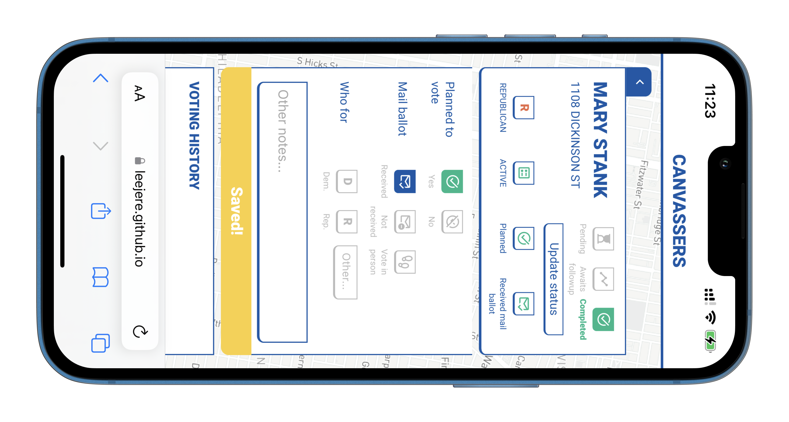
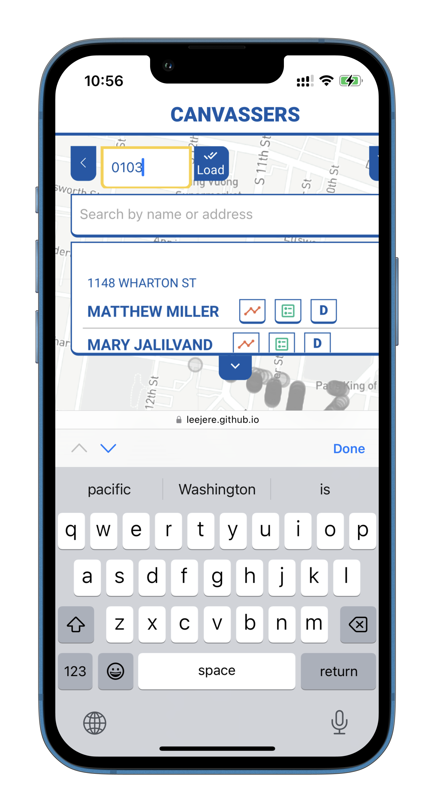
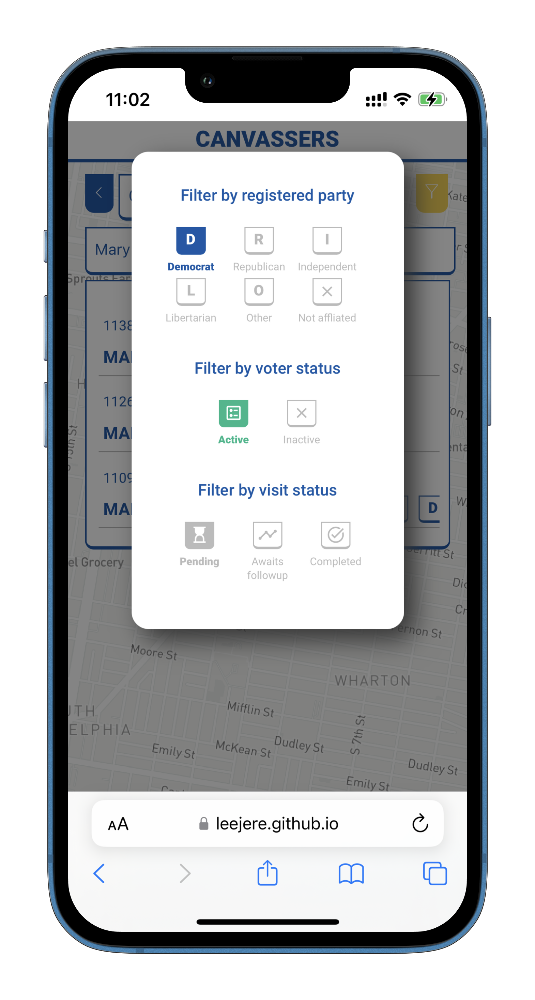
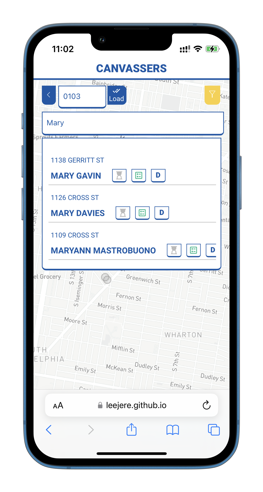
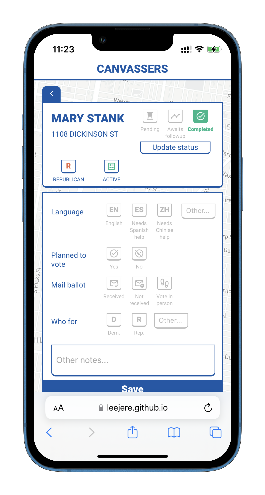
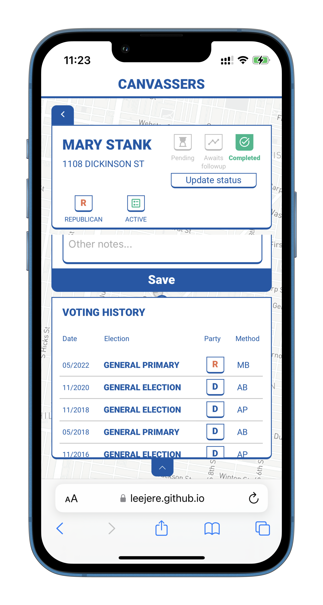
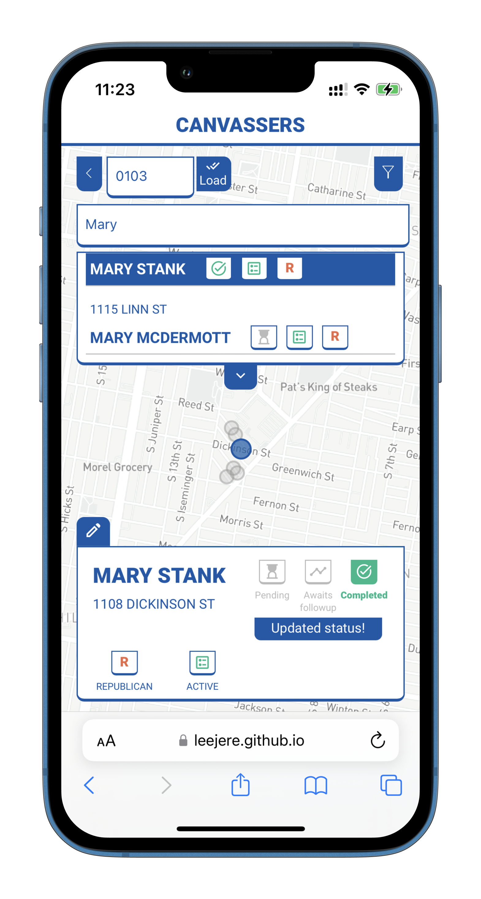
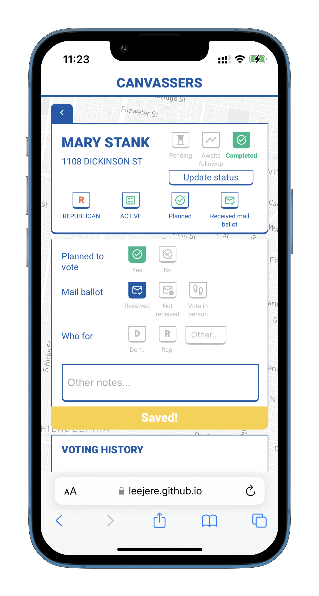

# **Canvassers**

## Visit the app [here](https://leejere.github.io/js-voter-canvassing/site/)

by **Jie Li ([@Leejere](https://github.com/Leejere))** and **Myron Bañez ([@myronbanez](https://github.com/myronbanez))**

This is a mobile-friendly web-app used for voter canvassing. With this app, the canvasser can select the voters from a list and a map, view their status and other information, and record additional information regarding each canvassed voter. The more specific [**PRD for this product**](https://github.com/Leejere/js-voter-canvassing/blob/dev/PRD.md) can be found in the same repository or via [**this link**](https://github.com/Leejere/js-voter-canvassing/blob/dev/PRD.md). The PRD was produced by Mjumbe Poe ([@mjumbewu](https://github.com/mjumbewu))

## **Data source**

The voter data comes from [Pennsylvania Department of State](https://www.dos.pa.gov/VotingElections/OtherServicesEvents/VotingElectionStatistics/Pages/VotingElectionStatistics.aspx), who provides voter registration data that includes the name, address, and other voting-related information. The data is available for purchase through [this link](https://www.pavoterservices.pa.gov/Pages/PurchasePAFULLVoterExport.aspx). For this application, only data from Philadelphia gets extracted, preprocessed, and geocoded by Mjumbe Poe ([@mjumbewu](https://github.com/mjumbewu)).

## **App Modules**

### **Module 0: Database APIs**

Data from the [Pennsylvania Department of State](https://www.dos.pa.gov/VotingElections/OtherServicesEvents/VotingElectionStatistics/Pages/VotingElectionStatistics.aspx) is stored in the same repo under the directory of `\data\voter-lists\`. Due to its large amount, the data is split into more 1,000 separate lists by neighborhood, which also acts as task lists for the canvassing team. One single list will be loaded at a time on demand in the next module.

At the same, the requirement document asks for the function of recording and saving additional information. This app uses [**Firebase**](https://firebase.google.com/docs/firestore) to store additional information recorded on canvassing visits. The saving and loading API calls are in the script of `main.js`.

### **Module 1: `list-loader`**

Each voter list can get loaded into the app asynchronously on demand via the `list-loader` widget. `list-loader.js` primarily deals with loading data. The loaded data gets stored in a global object, which is the data source for all other operations. The `list-loader` module is rerequisit for all other functions of the app.

- **Default list on page load.** By default, the same list that the user last used on their device is loaded. When the user last loaded the list, the list number was stored in `localStorage` and also on Firebase. On page load, the app first seeks `localStorage` for the previous list number. If such `localStorage` does not exist, the app makes an API call to Firebase and pulls the list number there. If both do not exist, **the first list (0101)** is loaded by default.

- **Custom list input widget** An input box exists on the top right of the viewport that allows the user to input a number, and then imports the corresponding list. The list loader is triggered either on **button click** or on **Enter keypress**.

- **Two API calls to the repo and Firebase.** When the loader is triggered, an API call is made to fetch voter data. On success, another API call is made to Firebase to pull down additional information recorded on previous canvassing visits. The Firebase database is organized by list number, so only data regarding this list is loaded.

- **Data update and display.** The data pulled from Firebase is used to update the data pulled from the repo. Then, the updated data is passed to **Module 2**.

Showcase:

| Number input | Data loaded |
|--|--|
| | |

### **Module 2: `list-filters`**

This filter filters voters after a particular voter list is loaded by name/address, registered party, voter status, and visit status. The kernel script for the function resides in `list-filters.js`. The filters work together in the following way:

1. **Data import.**
2. **Event listeners.** Event listeners get added to all filter widgets.
3. **Filter application.** Every time a filter event is recorded, whether a new filter is applied, or a filter is modified or canceled, the `allFilters` functions takes the imported data and applies **all the filters** to produce to filtered version of the data.
4. **Display update.** Use the filtered data to updated the voter list and map, which gets implemented in the **Module 3**.

Showcase:

| Filter window | Data filtered |
|--|--|
|||

### **Module 3: Voters display**

This model displayed either comprehensive or filtered voter data in a particular list in the voter list and on the map. 

-  `voter-list.js` takes the data, group them by address, and display them in a list. The list includes the voter's address, full name, and some icons that shows the voters canvassing status (pending visit, visited, awaiting followup, etc.), voter status (active or inactive), party registration, etc.

-  `map.js` takes the data, makes an geometry object (`FeatureCollection`), and display it on the map. Note that **every marker stands for one address** (house number + street name), rather than one voter.

Each displayed voter either on the map and on the list is attached with an event listener, ready to be selected in **Module 4**.

### **Module 4: Voter selection**

This module highlights a **maximum of one voter** as the "selected" voter. The module resides in `selected-voter.js` and contains the following components:

- A global variable to store the ID of the currently selected voter. If no voter is currently under selection, the variable remains `undefined`.
- Event listeners added on each voter list item and map marker. Note that as each map marker stands for an address rather than a voter, **the first voter by this address** is selected when the marker is clicked on.
- Whenever the list item or marker get clicked, it either 
  - **highlights a new voter**, 
  - **updats the highlighted voter**, or 
  - **unhighlights the currently highlighted voter**.
- The highlighted voter ID is recorded and passed into **Module 5**.

### **Module 5: Voter information display**

When a voter is currently highlighted, the most basic basic information regarding this voter is displayed on the bottom panel: name, address, visit status, and other information that was recorded on the previous visit (if any).

- **Basic information**: name and address.
- **Visit status**: either `pending`, `awaits followup`, or `completed`. This information is pulled from Firebase, and every voter is `pending` by default.
- **Other overview information**, e.g., registered party, whether received mail ballot, etc. Some of this information was recorded on the last visit and pulled from Firebase.

An Edit button exist on top of the basic-information panel. On click, the filters and voter list is hidden, and more information panels emerge.

- **Record panel**: displays voter information recorded on the last visit, if any. The user may record, edit, and save information on this panel via **Module 6**.
- **Voting history panel**: displays the past voting records of the selected voter. The list may expand on demand.

Showcase:

|Basic panel|Record panel|Voting history|
|-|-|-|
||||

### **Module 6: Data editing and saving**

The user may edit information via the "Update Status" button on the basic-information panel and the "Save" button on the record panel.

- The "Update Status" button only saves visit statuses, whereas the "Save" button saves all information.
- Whenever the user clicks a button or inputs some text, the unsaved edits will be temporarily recorded in the corresponding DOM object. When the save buttons are clicked, the unsaved chagnes get consolidated and uploaded to Firebase.
- A "toast" appears on the button to give feedback to the user that the information has been saved.

Showcase:

| Update Status | Final Save |
|-|-|
|||

## Collaboration

|Item|Contributor|
|--|--|
|Wireframing| Myron & Jie|
|Module 0: Firebase| Jie |
|Module 1: List loader| Jie|
|Module 1: Parsing CSVs| Myron|
|Module 2: List filters | Jie & Myron|
|Module 3: Voters display | Jie & Myron|
|Module 4: Voter selection| Jie|
|Module 5: Voter information display| Jie|
|Module 6: Data editing and saving| Jie|
|CSS|Jie & Myron|
